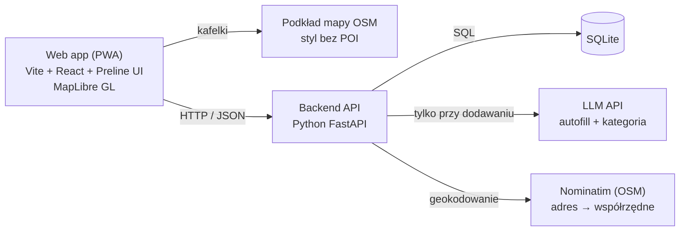

# Architektura

Jeden backend (FastAPI), jedna baza SQLite i trzy usługi zewnętrzne, bez kluczy Google i bez scrapingu. Frontend rozmawia tylko z naszym API, a LLM jest wołany wyłącznie przy dodawaniu wydarzenia.



## Stack

| Warstwa | Wybór | Uwagi |
| --- | --- | --- |
| Frontend | Vite + React + TypeScript, Tailwind CSS, Preline UI | Mobile-first, strona responsywna (desktop, tablet, telefon), ikony z `lucide-react` |
| Mapa | MapLibre GL JS + kafelki OSM (np. styl „liberty” z OpenFreeMap) | Ukryte warstwy POI, widoczny podpis © OpenStreetMap |
| Backend | Python 3.11+, FastAPI, uv | CORS dla `localhost:5173`, grafiki jako pliki statyczne |
| Baza | SQLite (SQLModel lub SQLAlchemy) | Odległość liczona w Pythonie (haversine), przy kilkuset wydarzeniach wystarczy |
| AI | Dowolne LLM API z wyjściem JSON | Tylko autofill i kategoria |
| Design | Claude Design, Figma, Canva | Makiety w Figmie, grafiki wydarzeń w Canvie |
| Organizacja | GitHub Issues + Projects, Discord | Kanał #decyzje jako dziennik ustaleń |

## Układ katalogów

```
apps/backend/app/
  main.py       aplikacja FastAPI, CORS, montowanie /static
  config.py     ustawienia z .env
  database.py   silnik SQLite i sesja
  models.py     tabele
  schemas.py    modele Pydantic zgodne z docs/API.md
  routes.py     endpointy
  init.py       tworzenie tabel przy starcie
apps/backend/seed.py        wczytuje data/events.json do bazy
apps/backend/static/img/    grafiki wydarzeń
apps/frontend/src/
  lib/api.ts         klient API (VITE_API_URL, zapas: plik mock)
  lib/categories.ts  kolory i ikony kategorii
  mock/events.json   kopia danych demo do pracy bez backendu
  components/        MapView, EventCard, SwipeDeck, ...
```

To propozycja zgodna z plikami, które już są w `apps/backend/app/`. Zmiany struktury zgłaszajcie na #decyzje.

## Model danych (SQLite)

| Tabela | Kolumny |
| --- | --- |
| `categories` | `id` TEXT PK, `name`, `color`, `icon` |
| `organizers` | `id` TEXT PK, `name`, `type` (kolo / samorzad / uczelnia / instytucja / lokal / uzytkownik), `university`, `verified` BOOL. Wydawca wydarzeń: profil organizacji albo konto użytkownika (`uzytkownik`) |
| `organization_members` | `organizer_id`, `user_id`, `role` (admin / editor); PK (`organizer_id`, `user_id`). Na MVP jeden admin z danych seed |
| `events` | `id` TEXT PK, `title`, `description`, `category` FK, `image_url`, `starts_at`, `ends_at`, `address`, `lat` REAL, `lng` REAL, `price` REAL, `type` (official = organizacja / grassroots = użytkownik), `capacity`, `size` (small <30 / medium 30–100 / large >100, liczone z `capacity`, brak = medium), `organizer_id` FK, `created_at` |
| `users` | `id` TEXT PK (UUID z frontendu), `email` (tylko konta), `display_name`, `created_at`. Gość nie musi mieć wiersza (patrz „Konta i dane lokalne”) |
| `category_weights` | `user_id`, `category`, `weight` REAL; PK (`user_id`, `category`) |
| `swipes` | `user_id`, `event_id`, `direction` (like / skip), `created_at`; PK (`user_id`, `event_id`) |
| `follows` | `user_id`, `organizer_id`; PK oba. Obserwować można organizację albo użytkownika |
| `recommendations` | `from_user_id`, `event_id`, `to_user_id`, `created_at`; polecenia wydarzeń obserwującym (roadmapa) |
| `reports` | `event_id`, `reporter_id`, `reason`, `created_at`; zgłoszenia nadużyć |
| `attendees` | `event_id`, `user_id`; PK oba |

Wydarzenia „wygasają” przez filtr w zapytaniu (`ends_at` lub `starts_at` w przeszłości), bez usuwania z bazy.

## Rekomendacje

Wynik wydarzenia dla użytkownika (0–1):

```
score = 0.35 · w_kategoria + 0.15 · dopasowanie_skali + 0.10 · dopasowanie_celu
      + 0.15 · bliskość + 0.15 · czas + 0.10 · obserwowany_organizator
```

Wagi są startowe i do strojenia po testach na danych demo.

- `w_kategoria`: waga kategorii użytkownika. Start z personalizacji (krok 1): wybrane = 0.7, reszta = 0.3. Swipe w prawo +0.1, w lewo −0.05, zawsze w przedziale 0–1.
- `dopasowanie_skali`: 1, gdy `size` wydarzenia jest wśród wybranych w kroku 2, 0.5 dla sąsiedniej skali (kameralne ↔ średnie, średnie ↔ duże), 0 dla przeciwnej. „Bez różnicy” lub brak odpowiedzi: 0.5 dla wszystkich.
- `dopasowanie_celu`: krok 3 mapuje cele na kategorie, a wynik to największe dopasowanie wydarzenia do wybranych celów (0–1). Brak odpowiedzi: 0.5.

  | Cel | Kategorie wspierające |
  | --- | --- |
  | poznać ludzi | gry, imprezy, sport, warsztaty (z małą skalą) |
  | nauczyć się czegoś | nauka, warsztaty |
  | dobrze się bawić | imprezy, muzyka, gry |
  | ruszyć się | sport |
  | kultura i spokój | kultura, muzyka |
  | oszczędzić | wydarzenia z ceną 0 |

- `bliskość`: 1 przy 0 km, liniowo do 0 przy promieniu z kroku 4 (domyślnie 5 km, haversine). Bez lokalizacji użytkownika: 0.5 dla wszystkich.
- `czas`: 1 dla wydarzeń dziś, 0.5 w tym tygodniu, 0.2 później. Pora z kroku 4 (po zajęciach / wieczory / weekendy) dodaje +0.2 (maks. 1) wydarzeniom w wybranych porach.
- `obserwowany_organizator`: 1 albo 0.
- Budżet z kroku 4 działa jak filtr domyślny, a nie składnik wyniku („tylko darmowe” ukrywa płatne, „do 20 zł” ukrywa droższe). Użytkownik może go zdjąć w filtrach.
- `reasons`: dwa składniki o największym wkładzie, po polsku („Twój match: gry”, „Twój match: kameralne”, „600 m od ciebie”, „Dziś 19:00”).

Formuła jest celowo prosta i wyjaśnialna. Collaborative filtering jest na roadmapie.

## Konta i dane lokalne

- **Gość:** preferencje z personalizacji, polubienia, pominięcia i obserwowani są w pamięci przeglądarki (localStorage / IndexedDB). Aplikacja działa bez rejestracji.
- **Konto:** przy rejestracji (link na e-mail, bez haseł) frontend wysyła lokalną bazę do backendu, który zapisuje ją na koncie. Dopiero konto może tworzyć wydarzenia, mieć profil, być obserwowane i polecać.
- **Organizacja:** osobny wiersz w `organizers` z członkami w `organization_members`. Wydarzenie publikuje się w imieniu organizacji (`organizer_id`), a nie osoby.
- **Do rozstrzygnięcia:** obecne endpointy `GET/POST /card/{user_id}` zakładają `user_id` generowany we frontendzie i przechowywany na serwerze. Skoro dane gościa mają zostać na urządzeniu, są dwie drogi: (a) backend bezstanowy, frontend wysyła preferencje i listę widzianych kart w żądaniu (lepsza prywatność, wymaga zmiany API), (b) anonimowy UUID z personalizacją przechowywaną na serwerze (zgodne z obecnym API, słabsza obietnica „dane tylko na urządzeniu”). Rekomendacja: (b) na hackathon, (a) docelowo, i uczciwy opis w [LEGAL.md](LEGAL.md).

## AI autofill

1. Autor (członek organizacji lub użytkownik z kontem) wkleja tekst posta.
2. Backend wysyła go do LLM z promptem, który wymaga wyłącznie JSON zgodnego z `draft` z [API.md](API.md#post-eventsparse), listą dozwolonych kategorii i dzisiejszą datą (do rozwiązywania „w czwartek”).
3. Backend waliduje odpowiedź Pydantic. Niepoprawny JSON = jedna ponowna próba, potem pusty szkic z `missing_fields`.
4. Organizator poprawia i zatwierdza w formularzu. Nic nie trafia do bazy bez zatwierdzenia.

Klucz API tylko w `apps/backend/.env`, nigdy we frontendzie.

## Decyzje

| Decyzja | Dlaczego | Alternatywa odrzucona |
| --- | --- | --- |
| Web app (PWA) zamiast natywnej | Jeden kod na telefon i desktop, szybciej w 24h | React Native, Flutter |
| SQLite | Zero konfiguracji, wystarczy na demo | Postgres + PostGIS |
| OSM + MapLibre | Darmowe, własny styl bez POI, brak klucza | Google Maps (warunki EOG zabraniają treści Places na mapie) |
| Brak scrapingu | Uwaga mentorów, ryzyko prawne | Agregacja stron i Facebooka |
| Brak push | Wymaga serwera wysyłającego, niska zgoda użytkowników | Web Push |
| Scoring zamiast ML | Wyjaśnialny, gotowy w kilka godzin | Model rekomendacyjny |
| Lokalizacja tylko na urządzeniu | Prywatność (RODO), brak potrzeby zapisu | Zapis pozycji na serwerze |
