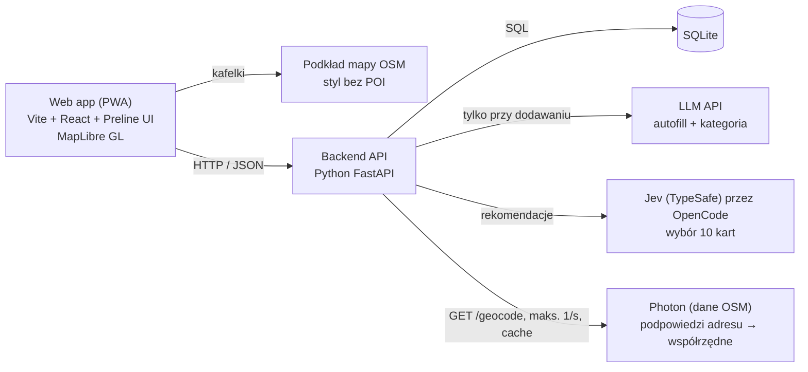

# Architektura

Jeden backend (FastAPI), jedna baza SQLite i trzy usługi zewnętrzne, bez kluczy Google i bez scrapingu. Frontend rozmawia tylko z naszym API. LLM jest wołany przy dodawaniu wydarzenia, a rekomendacje kart wybiera model Jev (TypeSafe AI) przez OpenCode.



## Stack

| Warstwa | Wybór | Uwagi |
| --- | --- | --- |
| Frontend | Vite + React + TypeScript, Tailwind CSS, Preline UI | Mobile-first, strona responsywna (desktop, tablet, telefon), ikony z `lucide-react` |
| Mapa | MapLibre GL JS + kafelki OSM (np. styl „liberty” z OpenFreeMap) | Ukryte warstwy POI, widoczny podpis © OpenStreetMap |
| Backend | Python 3.11+, FastAPI, uv | CORS dla `localhost:5173`, grafiki jako pliki statyczne |
| Baza | SQLite (SQLModel lub SQLAlchemy) | Odległość liczona w Pythonie (haversine), przy kilkuset wydarzeniach wystarczy |
| AI | Autofill: dowolne LLM API z wyjściem JSON. Rekomendacje: Jev 1.13 (TypeSafe AI) przez OpenCode | Autofill i kategoria oraz wybór 10 kart; klucz `OPENCODE_API_KEY` tylko w `.env` |
| Design | Claude Design, Figma, Canva | Makiety w Figmie, grafiki wydarzeń w Canvie, brand w [docs/BRAND.md](BRAND.md) |
| Organizacja | GitHub Issues + Projects, Discord | Kanał #decyzje jako dziennik ustaleń |

## Układ katalogów

```
apps/backend/app/
  main.py       aplikacja FastAPI, CORS, montowanie /static
  config.py     ustawienia z .env
  database.py   silnik SQLite i sesja
  models.py     tabele
  schemas.py    modele Pydantic zgodne z docs/API.md
  routes.py     endpointy
  init.py       tworzenie tabel przy starcie
apps/backend/seed.py        wczytuje data/events.json do bazy
apps/backend/static/img/    grafiki wydarzeń
apps/frontend/src/
  lib/api.ts         klient API (VITE_API_URL, zapas: plik mock)
  lib/categories.ts  kolory i ikony kategorii
  mock/events.json   kopia danych demo do pracy bez backendu
  components/        MapView, EventCard, SwipeDeck, ...
```

To propozycja zgodna z plikami, które już są w `apps/backend/app/`. Zmiany struktury zgłaszajcie na #decyzje.

## Model danych (SQLite)

| Tabela | Kolumny |
| --- | --- |
| `categories` | `id` TEXT PK, `name`, `color`, `icon` |
| `organizers` | `id` TEXT PK, `name`, `type` (kolo / samorzad / uczelnia / instytucja / lokal / uzytkownik), `university`, `verified` BOOL. Wydawca wydarzeń: profil organizacji albo konto użytkownika (`uzytkownik`) |
| `organization_members` | `organizer_id`, `user_id`, `role` (admin / editor); PK (`organizer_id`, `user_id`). Na MVP jeden admin z danych seed |
| `events` | `id` TEXT PK, `title`, `description`, `category` FK, `image_url`, `starts_at`, `ends_at`, `address`, `lat` REAL, `lng` REAL, `price` REAL, `type` (official = organizacja / grassroots = użytkownik), `capacity`, `size` (small <30 / medium 30–100 / large >100, liczone z `capacity`, brak = medium), `accessibility` JSON (patrz niżej), `organizer_id` FK, `created_at` |
| `users` | `id` TEXT PK (UUID z frontendu), `email` (tylko konta), `display_name`, `created_at`. Gość nie musi mieć wiersza (patrz „Konta i dane lokalne”) |
| `swipes` | `user_id`, `event_id`, `direction` (like / skip), `created_at`; PK (`user_id`, `event_id`) |
| `follows` | `user_id`, `organizer_id`; PK oba. Obserwować można organizację albo użytkownika |
| `recommendations` | `from_user_id`, `event_id`, `to_user_id`, `created_at`; polecenia wydarzeń obserwującym (roadmapa) |
| `reports` | `event_id`, `reporter_id`, `reason`, `created_at`; zgłoszenia nadużyć |
| `attendees` | `event_id`, `user_id`; PK oba |

`accessibility` (wydarzenie, a domyślnie miejsce/organizacja): `status` (accessible / partial / inaccessible / unknown), `step_free_entry`, `lift`, `door_width_cm`, `accessible_toilet`, `parking`, `transit_note`; każde pole `yes` / `no` / `unknown` plus `source` (organizer / osm / users). Dostępność miejsca z profilu organizacji jest dziedziczona, a pole wydarzenia ją nadpisuje. Dane OSM pochodzą ze znacznika `wheelchair` (yes / limited / no).

Wydarzenia „wygasają” przez filtr w zapytaniu (`ends_at` lub `starts_at` w przeszłości), bez usuwania z bazy.

## Rekomendacje

Rekomendacje wybiera model Jev 1.13 (System One, TypeSafe AI) wołany przez OpenCode (`POST https://opencode.ai/zen/v1/systemone`, model `jev-1.13` albo `jev-1.13-free`, nagłówek `Authorization: Bearer $OPENCODE_API_KEY`).

Rekomendacje wybiera model Jev 1.13 (System One, TypeSafe AI) wołany przez OpenCode (`POST https://opencode.ai/zen/v1/systemone`, model `jev-1.13` albo `jev-1.13-free`, nagłówek `Authorization: Bearer $OPENCODE_API_KEY`).

1. Backend losuje z bazy do 50 kart, na które użytkownik jeszcze nie odpowiedział (mniej niż 50 to nie błąd).
2. Pobiera wszystkie odpowiedzi użytkownika: prawo = interesuje go wydarzenie, lewo = nie interesuje.
3. Wysyła do Jev jedno zapytanie: stan (karty polubione, karty odrzucone, kandydaci) i po jednym pytaniu typu `noul` na kandydata („czy to wydarzenie zainteresuje użytkownika?”). Wszystkie pytania są liczone równolegle w jednym wywołaniu.
4. Pewność Jev w kandydacie to `|p - 0.5| * 2` (0 = pół na pół, 1 = pewny). Gdy jest niższa niż `JEV_MIN_CONFIDENCE` (domyślnie 0,2, czyli prawdopodobieństwo `tak` Jev między 40% a 60%; na zwykłych danych to ok. 13% kart), a ustawiono `DEEPINFRA_API_KEY`, decyzję o tej karcie podejmuje zamiast Jev model z DeepInfra (`FALLBACK_MODEL`, domyślnie `deepseek-ai/DeepSeek-V4.1-Flash`). Wołany jest przez DeepInfra (`POST https://api.deepinfra.com/v1/openai/chat/completions`, `Authorization: Bearer $DEEPINFRA_API_KEY`, `response_format: json_object`, `reasoning_effort: none`, bo DeepSeek V4 domyślnie myśli, a to jest wolne i zjada limit tokenów odpowiedzi). Dostaje ten sam stan, ale tylko z niepewnymi kandydatami, i odpowiada `tak` albo `nie` dla każdego. `tak` liczy się jako wynik `0,5 + próg/2`, `nie` jako `0,5 - próg/2`, więc taka karta jest za pewnymi `tak` Jev i przed jego pewnymi `nie`. Gdy model z DeepInfra zawiedzie, zostają wyniki Jev.
5. Backend sortuje kandydatów po wyniku `tak`, odrzuca niepoprawne odpowiedzi i zwraca 10 najlepszych (mniej, gdy kandydatów jest mniej).
6. Gdy Jev jest niedostępny, za wolny albo zwróci niepoprawną odpowiedź, backend zwraca do 10 losowych kandydatów zamiast błędu.

Do Jev i do modelu z DeepInfra trafiają tylko dane kart i decyzje, bez identyfikatora użytkownika. Wyniki nie są zapisywane w bazie.

### Personalizacja w rekomendacjach

Odpowiedzi z personalizacji przy pierwszym uruchomieniu ([SPEC.md](SPEC.md#personalizacja-przy-pierwszym-uruchomieniu)) wchodzą do rekomendacji na dwa sposoby:

- **Twarde filtry przy losowaniu kandydatów (krok 1 powyżej):** budżet (tylko darmowe / do 20 zł), promień odległości (gdy znana lokalizacja) i pora (po zajęciach / wieczory / weekendy). Użytkownik może je zdjąć w filtrach.
- **Kontekst dla Jev (krok 3):** do stanu dochodzi krótki opis preferencji użytkownika: wybrane kategorie, preferowana skala wydarzeń, cele („poznać ludzi”, „nauczyć się czegoś” itd.). Dzięki temu pierwsza talia jest trafna, zanim użytkownik zrobi pierwszy swipe.
- **Dostępność:** filtr „dostępne dla wózka” z personalizacji jest twardym filtrem przy losowaniu kandydatów: dopuszcza `accessible` i `partial`, a `unknown` tylko po jawnym włączeniu przez użytkownika.
- **Skala wydarzenia:** karta ma pole `size` (small <30 / medium 30–100 / large >100, liczone z `capacity`, brak = medium), żeby model mógł dopasować wielkość.
- **Uzasadnienie na karcie:** backend składa je z odpowiedzi użytkownika i danych wydarzenia, np. „Twój match: kameralne · planszówki · za darmo”.
- **Brak odpowiedzi** nie blokuje działania: kandydaci losowani są bez filtrów, a Jev dostaje tylko decyzje ze swipe'ów.

Wysyłanie preferencji do Jev wymaga zgody z punktu widzenia prywatności (patrz „Konta i dane lokalne” i [LEGAL.md](LEGAL.md)): preferencje nie zawierają identyfikatora użytkownika, tak samo jak karty i decyzje.

Formuła punktowa (waga kategorii, bliskość, czas) zostaje jako zapas rozważany do wersji bez zewnętrznego modelu.

## Konta i dane lokalne

- **Gość:** preferencje z personalizacji, polubienia, pominięcia i obserwowani są w pamięci przeglądarki (localStorage / IndexedDB). Aplikacja działa bez rejestracji.
- **Konto:** przy rejestracji (link na e-mail, bez haseł) frontend wysyła lokalną bazę do backendu, który zapisuje ją na koncie. Dopiero konto może tworzyć wydarzenia, mieć profil, być obserwowane i polecać.
- **Organizacja:** osobny wiersz w `organizers` z członkami w `organization_members`. Wydarzenie publikuje się w imieniu organizacji (`organizer_id`), a nie osoby.
- **Do rozstrzygnięcia:** obecne endpointy `GET/POST /card/{user_id}` zakładają `user_id` generowany we frontendzie i przechowywany na serwerze. Skoro dane gościa mają zostać na urządzeniu, są dwie drogi: (a) backend bezstanowy, frontend wysyła preferencje i listę widzianych kart w żądaniu (lepsza prywatność, wymaga zmiany API), (b) anonimowy UUID z personalizacją przechowywaną na serwerze (zgodne z obecnym API, słabsza obietnica „dane tylko na urządzeniu”). Rekomendacja: (b) na hackathon, (a) docelowo, i uczciwy opis w [LEGAL.md](LEGAL.md).

## AI autofill

1. Autor (członek organizacji z pakietem sponsorskim) wkleja tekst posta. Studenci z kontem wypełniają formularz ręcznie.
2. Backend wysyła go do LLM z promptem, który wymaga wyłącznie JSON zgodnego z `draft` z [API.md](API.md#post-eventsparse), listą dozwolonych kategorii i dzisiejszą datą (do rozwiązywania „w czwartek”).
3. Backend waliduje odpowiedź Pydantic. Niepoprawny JSON = jedna ponowna próba, potem pusty szkic z `missing_fields`.
4. Organizator poprawia i zatwierdza w formularzu. Nic nie trafia do bazy bez zatwierdzenia.

Klucz API tylko w `apps/backend/.env`, nigdy we frontendzie.

## Decyzje

| Decyzja | Dlaczego | Alternatywa odrzucona |
| --- | --- | --- |
| Web app (PWA) zamiast natywnej | Jeden kod na telefon i desktop, szybciej w 24h | React Native, Flutter |
| SQLite | Zero konfiguracji, wystarczy na demo | Postgres + PostGIS |
| OSM + MapLibre | Darmowe, własny styl bez POI, brak klucza | Google Maps (warunki EOG zabraniają treści Places na mapie) |
| Brak scrapingu | Uwaga mentorów, ryzyko prawne | Agregacja stron i Facebooka |
| Brak push | Wymaga serwera wysyłającego, niska zgoda użytkowników | Web Push |
| Jev do rekomendacji | Szybki (setki ms), tani, zwraca typowane prawdopodobieństwa, nie halucynuje; losowy zapas przy awarii | Własna formuła scoringu, klasyczny LLM z generowanym tekstem |
| Lokalizacja tylko na urządzeniu | Prywatność (RODO), brak potrzeby zapisu | Zapis pozycji na serwerze |
