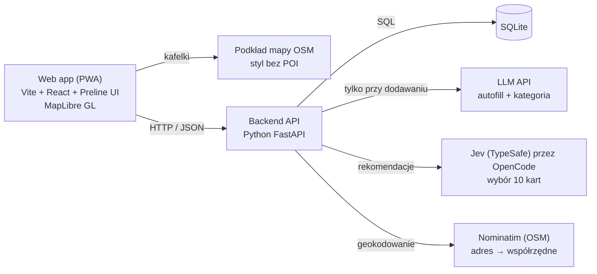

# Architektura

Jeden backend (FastAPI), jedna baza SQLite i trzy usługi zewnętrzne, bez kluczy Google i bez scrapingu. Frontend rozmawia tylko z naszym API. LLM jest wołany przy dodawaniu wydarzenia, a rekomendacje kart wybiera model Jev (TypeSafe AI) przez OpenCode.



## Stack

| Warstwa | Wybór | Uwagi |
| --- | --- | --- |
| Frontend | Vite + React + TypeScript, Tailwind CSS, Preline UI | Mobile-first, strona responsywna (desktop, tablet, telefon), ikony z `lucide-react` |
| Mapa | MapLibre GL JS + kafelki OSM (np. styl „liberty” z OpenFreeMap) | Ukryte warstwy POI, widoczny podpis © OpenStreetMap |
| Backend | Python 3.11+, FastAPI, uv | CORS dla `localhost:5173`, grafiki jako pliki statyczne |
| Baza | SQLite (SQLModel lub SQLAlchemy) | Odległość liczona w Pythonie (haversine), przy kilkuset wydarzeniach wystarczy |
| AI | Autofill: dowolne LLM API z wyjściem JSON. Rekomendacje: Jev 1.13 (TypeSafe AI) przez OpenCode | Autofill i kategoria oraz wybór 10 kart; klucz `OPENCODE_API_KEY` tylko w `.env` |
| Design | Claude Design, Figma, Canva | Makiety w Figmie, grafiki wydarzeń w Canvie |
| Organizacja | GitHub Issues + Projects, Discord | Kanał #decyzje jako dziennik ustaleń |

## Układ katalogów

```
apps/backend/app/
  main.py       aplikacja FastAPI, CORS, montowanie /static
  config.py     ustawienia z .env
  database.py   silnik SQLite i sesja
  models.py     tabele
  schemas.py    modele Pydantic zgodne z docs/API.md
  routes.py     endpointy
  init.py       tworzenie tabel przy starcie
apps/backend/seed.py        wczytuje data/events.json do bazy
apps/backend/static/img/    grafiki wydarzeń
apps/frontend/src/
  lib/api.ts         klient API (VITE_API_URL, zapas: plik mock)
  lib/categories.ts  kolory i ikony kategorii
  mock/events.json   kopia danych demo do pracy bez backendu
  components/        MapView, EventCard, SwipeDeck, ...
```

To propozycja zgodna z plikami, które już są w `apps/backend/app/`. Zmiany struktury zgłaszajcie na #decyzje.

## Model danych (SQLite)

| Tabela | Kolumny |
| --- | --- |
| `categories` | `id` TEXT PK, `name`, `color`, `icon` |
| `organizers` | `id` TEXT PK, `name`, `type` (kolo / samorzad / uczelnia / lokal / student), `university`, `verified` BOOL |
| `events` | `id` TEXT PK, `title`, `description`, `category` FK, `image_url`, `starts_at`, `ends_at`, `address`, `lat` REAL, `lng` REAL, `price` REAL, `type` (official / grassroots), `capacity`, `organizer_id` FK, `created_at` |
| `users` | `id` TEXT PK (UUID z frontendu), `university`, `created_at` |
| `swipes` | `user_id`, `event_id`, `direction` (like / skip), `created_at`; PK (`user_id`, `event_id`) |
| `follows` | `user_id`, `organizer_id`; PK oba |
| `attendees` | `event_id`, `user_id`; PK oba |

Wydarzenia „wygasają” przez filtr w zapytaniu (`ends_at` lub `starts_at` w przeszłości), bez usuwania z bazy.

## Rekomendacje

Rekomendacje wybiera model Jev 1.13 (System One, TypeSafe AI) wołany przez OpenCode (`POST https://opencode.ai/zen/v1/systemone`, model `jev-1.13` albo `jev-1.13-free`, nagłówek `Authorization: Bearer $OPENCODE_API_KEY`).

1. Backend losuje z bazy do 50 kart, na które użytkownik jeszcze nie odpowiedział (mniej niż 50 to nie błąd).
2. Pobiera wszystkie odpowiedzi użytkownika: prawo = interesuje go wydarzenie, lewo = nie interesuje.
3. Wysyła do Jev jedno zapytanie: stan (karty polubione, karty odrzucone, kandydaci) i po jednym pytaniu typu `noul` na kandydata („czy to wydarzenie zainteresuje użytkownika?”). Wszystkie pytania są liczone równolegle w jednym wywołaniu.
4. Backend sortuje kandydatów po prawdopodobieństwie `tak`, odrzuca niepoprawne odpowiedzi i zwraca 10 najlepszych (mniej, gdy kandydatów jest mniej).
5. Gdy Jev jest niedostępny, za wolny albo zwróci niepoprawną odpowiedź, backend zwraca do 10 losowych kandydatów zamiast błędu.

Do Jev trafiają tylko dane kart i decyzje, bez identyfikatora użytkownika. Wyniki nie są zapisywane w bazie.

## AI autofill

1. Organizator wkleja tekst posta.
2. Backend wysyła go do LLM z promptem, który wymaga wyłącznie JSON zgodnego z `draft` z [API.md](API.md#post-eventsparse), listą dozwolonych kategorii i dzisiejszą datą (do rozwiązywania „w czwartek”).
3. Backend waliduje odpowiedź Pydantic. Niepoprawny JSON = jedna ponowna próba, potem pusty szkic z `missing_fields`.
4. Organizator poprawia i zatwierdza w formularzu. Nic nie trafia do bazy bez zatwierdzenia.

Klucz API tylko w `apps/backend/.env`, nigdy we frontendzie.

## Decyzje

| Decyzja | Dlaczego | Alternatywa odrzucona |
| --- | --- | --- |
| Web app (PWA) zamiast natywnej | Jeden kod na telefon i desktop, szybciej w 24h | React Native, Flutter |
| SQLite | Zero konfiguracji, wystarczy na demo | Postgres + PostGIS |
| OSM + MapLibre | Darmowe, własny styl bez POI, brak klucza | Google Maps (warunki EOG zabraniają treści Places na mapie) |
| Brak scrapingu | Uwaga mentorów, ryzyko prawne | Agregacja stron i Facebooka |
| Brak push | Wymaga serwera wysyłającego, niska zgoda użytkowników | Web Push |
| Jev do rekomendacji | Szybki (setki ms), tani, zwraca typowane prawdopodobieństwa, nie halucynuje; losowy zapas przy awarii | Własna formuła scoringu, klasyczny LLM z generowanym tekstem |
| Lokalizacja tylko na urządzeniu | Prywatność (RODO), brak potrzeby zapisu | Zapis pozycji na serwerze |
